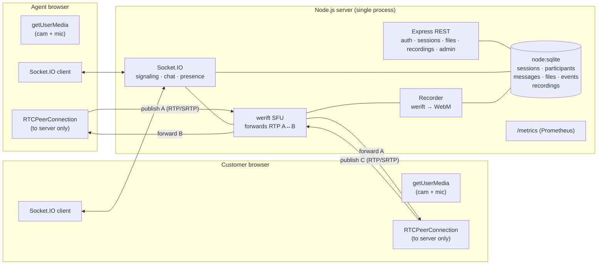

# Architecture & Design

## 1. Goal and the one hard constraint

Build a customer-support video platform we **fully own and operate**: an agent and a customer
talk over real-time audio/video from the browser, chat, share files, and the call can be
recorded for review.

The defining constraint: **media must route through our own server**, never peer-to-peer, and
**no third-party hosted video API**. That makes the server a **Selective Forwarding Unit
(SFU)** — it terminates a WebRTC connection from each browser, receives their media, and
forwards it to the other participant.

A second, practical constraint shaped every technology choice: the target machine had **no C++
toolchain, no ffmpeg, no Docker**. So every dependency is **pure-JS or ships a prebuilt
binary** — notably the SFU (werift) and the database (Node's built-in `node:sqlite`). The
result installs and runs with `npm install` + `npm start`, nothing else.

## 2. System overview

> A standalone diagram image is also available at **[docs/architecture.svg](docs/architecture.svg)**
> (open in a browser or import into a slide/PDF). The same system is shown as Mermaid below.



The browsers **only ever connect to the server**. `A2` and `C2` are connected to `SFU`, not to
each other — that is what makes this an SFU and not P2P.

## 3. Components & separation of concerns

| Layer        | Module(s)                              | Responsibility |
|--------------|----------------------------------------|----------------|
| HTTP / REST  | `src/api/*`                            | Login, session CRUD + history, file up/download, recording status/download, admin |
| Realtime     | `src/realtime/index.ts`, `chat.ts`, `presence.ts` | Socket.IO auth handshake, join/leave, chat, roster, reconnect grace |
| Media plane  | `src/realtime/sfu.ts`                  | Per-session WebRTC peers, RTP track forwarding, renegotiation |
| Recording    | `src/realtime/recorder.ts`             | Mux live tracks → WebM, status lifecycle |
| Auth         | `src/auth/*`                           | JWT (account + invite), scrypt passwords, role middleware |
| Domain svc   | `src/services/sessions.ts`             | Create/end session, build the persisted record (shared by REST + sockets) |
| Persistence  | `src/db/*`                             | `node:sqlite` connection, schema, typed repositories |
| Metrics      | `src/metrics/metrics.ts`               | Prometheus registry + gauges/counters |
| Client       | `public/js/*`                          | Vanilla-JS agent/customer/admin UIs, WebRTC controller |

The REST and realtime layers are **decoupled by an in-process event bus** (`src/bus.ts`): an
HTTP call (or the admin dashboard) can end a session without importing Socket.IO internals; the
realtime layer subscribes and tears down the live connections + SFU resources.

## 4. Roles & access control

Two token kinds, both signed with the same server secret and distinguished by a `kind` claim so
one can never be replayed as the other:

- **Account token** (`agent` / `admin`) — issued on login. Required for creating/ending
  sessions, recording, and all admin endpoints.
- **Invite token** (`customer`) — minted per session, scoped to that `sessionId`, expiring.
  Lets a customer join exactly one session and nothing else.

Authorization is **always enforced server-side** — the client never asserts its own role:

- Every mutating REST route runs through `requireAccount` / `requireRole('admin')`.
- The Socket.IO **handshake middleware** validates the token, derives the role, confirms the
  session is active and (for agents) owned by the caller, and binds the role to the socket.
- Every socket event re-checks: `end-session`, `start-recording`, `stop-recording` reject
  anyone who isn't the agent on that socket.

## 5. Media flow (the SFU)

Each browser opens **one bidirectional `RTCPeerConnection` to the server** and publishes its
camera + mic. On the server (werift), for each incoming track we create a **relay
`MediaStreamTrack`** and pipe the publisher's RTP into it (`onReceiveRtp → relay.writeRtp`).
That relay is then added to the *other* participant's server-side peer connection, which
renegotiates and starts sending. Keyframes for a freshly-subscribed viewer are pulled with RTCP
PLI.

```
Agent cam ─▶ A’s server PC ─▶ relayA ─▶ Customer’s server PC ─▶ Customer
Customer cam ─▶ C’s server PC ─▶ relayC ─▶ Agent’s server PC ─▶ Agent
```

**Negotiation model (glare-free).** The client makes the *initial* publish offer. After that,
**all renegotiation offers are server-initiated** and gated on `signalingState === 'stable'`.
Because two media events can arrive within one tick and Socket.IO doesn't await async
listeners, **both sides serialize SDP through a promise chain**, and the client is a *polite*
peer (rolls back its own offer if a server offer collides). This combination is what makes the
second participant join reliably instead of getting stuck in `connecting` (a real bug we hit
and fixed — see the commit history / `scripts/browser-sfu-check.mjs`).

## 6. Reconnect handling

Participant identity lives in SQLite; the volatile bits (grace timers, live mute/camera state)
live in `presence.ts`. On an unexpected socket drop we mark the participant `disconnected` and
start a **grace timer** (`RECONNECT_GRACE_MS`, default 15s) instead of removing them. If they
reconnect within the window — re-presenting their participant id — we cancel the timer, rebind,
and **never emit a "left" event to the peer**. Only if the window expires are they treated as
having left.

## 7. Data model

```
agents(id, username, password_hash, display_name, role, created_at)
sessions(id, title, agent_id→agents, status, invite_token, created_at, ended_at, ended_by)
participants(id, session_id→sessions, role, display_name, socket_id, status, joined_at, left_at)
messages(id, session_id, sender_participant_id, sender_role, sender_name, body, file_id→files, created_at)
files(id, session_id, uploader_participant_id, original_name, stored_name, mime, size, created_at)
events(id, session_id, type, participant_id, metadata_json, created_at)   -- join/leave/mute/recording/…
recordings(id, session_id, status, file_path, started_at, ended_at, duration_sec)
```

The `events` table is an append-only timeline that powers both **session history** (who joined,
when, how long) and the **admin event log**. All access goes through typed repositories using
**parameterised statements** (no string interpolation → no SQL injection).

## 8. Security

- JWT-gated REST + socket auth; roles enforced on every action, server-side.
- Invite tokens are signed, expiring, and scoped to a single session.
- Passwords hashed with **scrypt** (`node:crypto`), verified in constant time.
- **Helmet** security headers + a Content-Security-Policy; **rate limiting** on login.
- File uploads: **MIME allowlist + size cap + randomised stored filenames** (the original name
  never touches the filesystem → no path traversal); the uploads directory is **never served
  statically** — downloads go through an access-controlled route.
- Recording downloads require the owning agent or an admin.

## 9. Observability

`/metrics` exposes a Prometheus exposition: gauges (`support_active_sessions`,
`support_connected_participants`), counters (`support_sessions_created_total`,
`support_chat_messages_total`, `support_errors_total`), and a call-duration histogram, plus
default Node process metrics. Scrape it from Prometheus/Grafana with no extra glue.

## 10. Future scaling

The demo runs as a single Node process, but the design scales horizontally. To hold up under
many concurrent sessions:

- **Multiple Node instances** behind a load balancer. Sessions are already isolated by id, so
  work shards cleanly.
- **Redis adapter for Socket.IO**, so signaling/chat/presence fan out across instances.
- **Dedicated SFU nodes** — split the media plane from the API plane and route all participants
  of a session to the same SFU node (consistent hashing on `sessionId`); the media plane is the
  CPU-bound part and scales independently.
- **Object storage (S3-compatible)** for recordings and uploaded files instead of local disk.
- **PostgreSQL** in place of SQLite for concurrent writes, HA, and richer querying.
- **Externalised session/presence state** (Redis) so the API tier is stateless and any instance
  can serve any request.
- **TURN servers** for participants behind restrictive NATs (the SFU already speaks ICE; adding
  TURN is configuration, not code).

Because state is already centralised in the DB and the media/API planes are logically separate,
moving from one box to this topology is an infrastructure change, not a rewrite.
